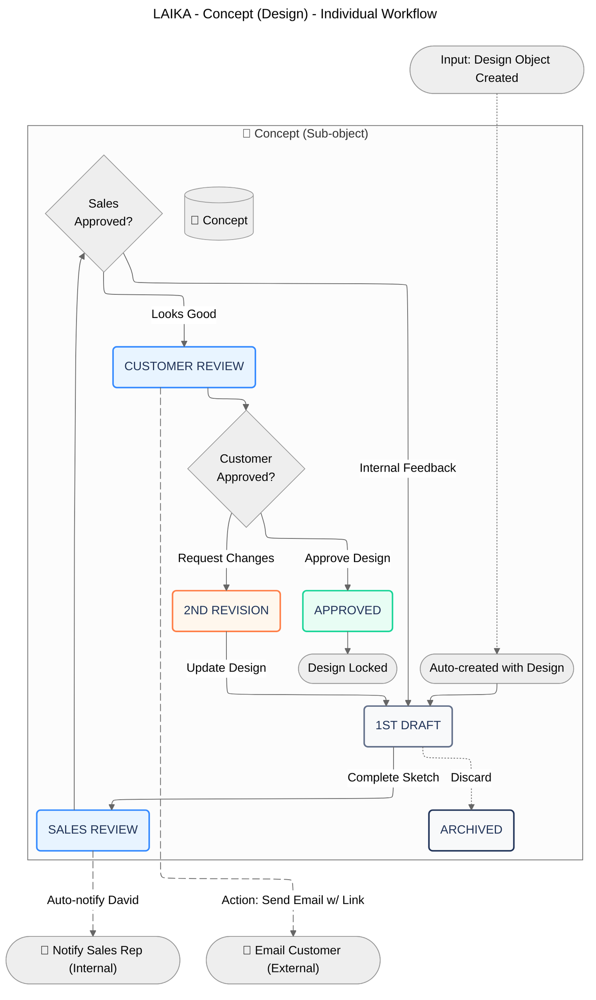

# Cards

Cards group related content and help users scan key information quickly.

## Example

<Card title="Quickstart" href="/quickstart" icon="zap" horizontal="false">
  Get up and running in a few minutes.
</Card>

## Learn more

Read the full Card guide at [https://documentation.ai/docs/components/card](https://documentation.ai/docs/components/card).

