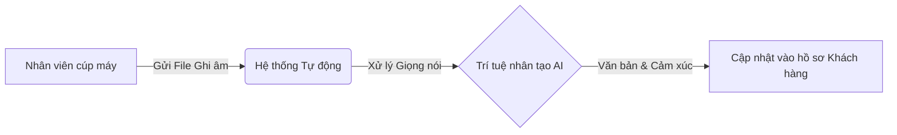
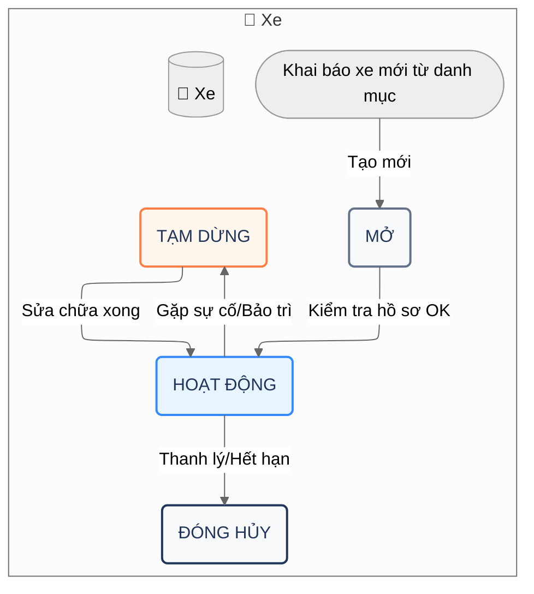
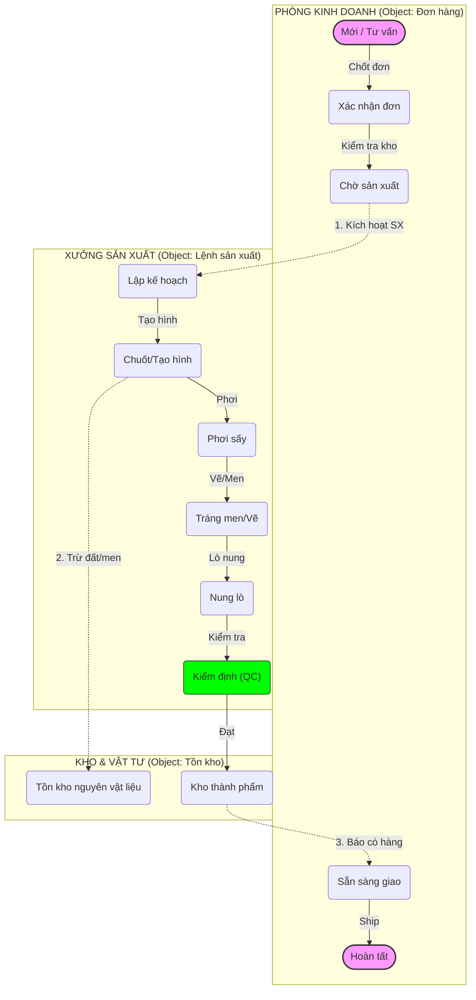

## Tổng quan

Tài liệu này hướng dẫn bạn cách thiết lập 3 quy trình tự động hóa cốt lõi cho bộ phận **Sales & Growth**. Các công cụ này giúp tăng tốc độ xử lý khách hàng, giảm thao tác thủ công và cung cấp thông tin chi tiết cho nhân viên kinh doanh.

<Columns cols="3">
  <Card title="Thu hồi Lead tự động" href="#thu-hoi-lead-tu-dong-ic-10" icon="clock" horizontal="false">
    Tự động thu hồi Lead về kho chung nếu sau 2 giờ không có tương tác.
  </Card>

  <Card title="Click-to-Call" href="#goi-dien-nhanh-cs-05" icon="phone" horizontal="false">
    Bấm gọi trực tiếp cho khách hàng ngay trên giao diện phần mềm.
  </Card>

  <Card title="Trợ lý AI cuộc gọi" href="#tro-ly-ai-cuoc-goi-cs-06" icon="cpu" horizontal="false">
    Tự động ghi âm, chép lời và tóm tắt nội dung cuộc gọi.
  </Card>
</Columns>

## Điều kiện cần

Trước khi bắt đầu, hãy đảm bảo bạn đã chuẩn bị:

- Tài khoản quản trị hệ thống (Admin) trên Luklak.

- Tài khoản từ nhà cung cấp tổng đài (ví dụ: 3CX, Stringee, Omicall).

- Gói tích hợp AI (để sử dụng tính năng tóm tắt).

<Callout kind="info" collapsed="false">
  **Lưu ý:** Tính năng AI tóm tắt cuộc gọi sẽ xử lý dữ liệu giọng nói. Hãy đảm bảo chính sách bảo mật của công ty bạn cho phép việc ghi âm và phân tích cuộc gọi.
</Callout>

/

## Thu hồi Lead tự động (IC-10)

Quy trình này giúp đảm bảo mọi khách hàng tiềm năng (Lead) đều được chăm sóc kịp thời. Nếu nhân viên được chia Lead mà "bỏ quên" quá 2 tiếng, hệ thống sẽ lấy lại Lead đó để chia cho người khác.

**Nguyên lý:** Nếu trạng thái Lead là "Mới" và thời gian tạo đã quá 2 giờ, hệ thống sẽ chuyển "Người phụ trách" về trạng thái "Chưa phân công".

<Steps>
  <Step title="Truy cập cài đặt Automation" icon="settings" title-type="h3">
    Vào không gian **Sales & CRM > Cài đặt > Automation Rules**. Nhấn **Tạo luật mới**.
  </Step>

  <Step title="Thiết lập điều kiện kích hoạt" icon="filter" title-type="h3">
    Chọn loại kích hoạt là **Lịch trình (Schedule)**, chạy mỗi 15 phút.

    *Điều kiện lọc:*

    - **Trạng thái** là `Mới`

    - **Thời gian tạo** cũ hơn `2 giờ`

    - **Người phụ trách** khác `Chưa phân công`
  </Step>

  <Step title="Cấu hình hành động" icon="rotate-ccw" title-type="h3">
    Chọn hành động **Cập nhật bản ghi (Update Record)**:

    - **Trường dữ liệu:** `Người phụ trách (Owner)`

    - **Giá trị mới:** `Trống (Lead Pool)`
  </Step>
</Steps>

## Gọi điện nhanh (CS-05)

Tích hợp tổng đài ảo giúp nhân viên Sales chỉ cần bấm nút "Gọi" trên màn hình thay vì phải bấm số thủ công trên điện thoại bàn.

### Cấu hình kết nối

<Tabs>
  <Tab title="Stringee / Omicall" icon="cloud">
    Sử dụng giao thức API để kết nối trực tiếp.

    <Expandable title="Xem cấu hình mẫu đơn giản" default-open="true">
      Bạn chỉ cần điền thông tin xác thực vào hành động **HTTP Request**:

      1. **URL:** Đường dẫn API của nhà cung cấp (ví dụ: `api.stringee.com/...`)

      2. **Token:** Mã xác thực (được cấp bởi nhà mạng)

      3. **Số máy nhánh:** Chọn biến số `{{current_user.extension}}` (Số máy lẻ của nhân viên đang thao tác)
    </Expandable>
  </Tab>

  <Tab title="3CX / Tổng đài cứng" icon="server">
    Đối với tổng đài 3CX, hệ thống sẽ gửi lệnh điều khiển tới máy chủ của bạn.

    <Callout kind="tip" collapsed="false">
      Hãy yêu cầu bộ phận IT mở cổng kết nối (Port Forwarding) để phần mềm Luklak có thể "nói chuyện" được với máy chủ tổng đài đặt tại văn phòng.
    </Callout>
  </Tab>
</Tabs>

## Trợ lý AI cuộc gọi (CS-06)

Đây là tính năng cao cấp giúp tự động hóa việc ghi chép (Note). Sau khi cúp máy, AI sẽ nghe lại cuộc gọi và viết báo cáo cho bạn.

### Luồng hoạt động

### Kết quả nhận được

Sau khi cài đặt xong, mỗi khi kết thúc cuộc gọi, hồ sơ khách hàng sẽ tự động xuất hiện các thông tin sau:

<Columns cols="2">
  <Card title="Nội dung tóm tắt" icon="file-text" horizontal="false">
    AI sẽ gạch đầu dòng các ý chính đã trao đổi, ví dụ: "Khách quan tâm đến gói Pro, còn lăn tăn về giá."
  </Card>

  <Card title="Đánh giá cảm xúc" icon="smile" horizontal="false">
    AI chấm điểm thái độ khách hàng: **Tích cực**, **Trung lập** hoặc **Tiêu cực**.
  </Card>
</Columns>

<Expandable title="Bạn cần chuẩn bị gì để kích hoạt?" default-open="false">
  Để tính năng này hoạt động, bạn cần cấu hình **Webhook** (Cổng nhận dữ liệu) trên trang quản trị của tổng đài:

  1. Vào trang quản trị tổng đài.

  2. Tìm mục **Event Webhook** hoặc **Call End Notification**.

  3. Dán đường dẫn Webhook mà Luklak cung cấp (ví dụ: `https://hooks.luklak.com/...`).
</Expandable>

## Kiểm tra hoạt động

Sau khi thiết lập, hãy thực hiện các bước kiểm tra sau để đảm bảo hệ thống chạy ổn định:

1. **Thử thu hồi Lead:** Tạo một Lead thử nghiệm, chỉnh thời gian tạo lùi lại 3 tiếng. Chờ 15 phút xem Lead có bị thu hồi không.

2. **Thử gọi điện:** Bấm nút gọi trên phần mềm, điện thoại của bạn (Softphone/App) phải đổ chuông trước, sau đó mới kết nối tới khách.

3. **Thử AI:** Thực hiện một cuộc gọi ngắn (tối thiểu 10 giây). Kiểm tra mục **Nhật ký hoạt động** của khách hàng sau 1-2 phút xem có bài tóm tắt từ AI không.

<Callout kind="success" collapsed="false">
  **Mẹo:** Nếu bạn thấy AI tóm tắt chưa chuẩn, hãy cung cấp thêm cho nó "kịch bản mẫu" hoặc từ khóa chuyên ngành trong phần cài đặt nhắc lệnh (Prompt Settings).
</Callout>

