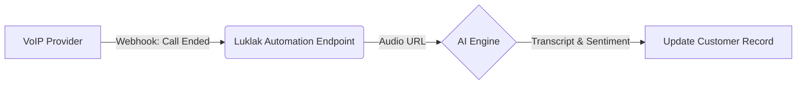

## Overview

This guide details the configuration of three critical automation rules for the **Sales & Growth** department. These tools are designed to increase lead velocity, reduce manual entry, and provide actionable intelligence for your Sales Representatives.

<Columns cols="3">
  <Card title="Lead Auto-Reclaim" icon="clock" href="#lead-auto-reclaim-ic-10" horizontal="false">
    Automatically return untouched leads to the pool after 2 hours.
  </Card>
  <Card title="Click-to-Call" icon="phone" href="#click-to-call-cs-05" horizontal="false">
    Trigger VoIP calls directly from the Deal record.
  </Card>
  <Card title="AI Call Intel" icon="cpu" href="#ai-call-intel-cs-06" horizontal="false">
    Transcribe and summarize calls automatically.
  </Card>
</Columns>

## Prerequisites

Before configuring these automations, ensure you have the following:

- **System Admin** privileges in the Luklak platform.
- **API Keys** from your VoIP provider (e.g., 3CX, Stringee).
- **OpenAI API Key** (or equivalent) for the AI summarization engine.

<Callout kind="alert">
  **Data Privacy Warning:** Enabling AI Call Intel involves sending audio data to third-party processors. Ensure your privacy policy covers data processing for call recording and transcription.
</Callout>

## Lead Auto-Reclaim (IC-10)

This internal rule enforces accountability by reclaiming leads that have not been acted upon within a specific timeframe.

**Logic:** If a `Deal` status is "New" and the `Created Time` is greater than 2 hours ago, the system reassigns the `Owner` to "Unassigned".

<Steps>
  <Step title="Access Automation Rules" icon="settings" title-type="h3">
    Navigate to **Sales & CRM Space > Settings > Automation Rules**. Click **New Rule**.
  </Step>

  <Step title="Define Trigger Condition" icon="filter" title-type="h3">
    Set the trigger to run on a schedule (every 15 minutes) targeting the `Deal` object.

    ```json
    {
      "object": "Deal",
      "trigger": "Schedule",
      "frequency": "15m",
      "condition": {
        "AND": [
          { "field": "status", "operator": "equals", "value": "New" },
          { "field": "created_at", "operator": "older_than", "value": "2h" },
          { "field": "owner", "operator": "is_not", "value": "Unassigned" }
        ]
      }
    }
    ```
  </Step>

  <Step title="Configure Reclaim Action" icon="rotate-ccw" title-type="h3">
    Set the action to update the record owner.

    **Target Field:** `Owner`
    **New Value:** `NULL` (Unassigned / Lead Pool)
  </Step>
</Steps>

## Click-to-Call (CS-05)

Integrate your telephony provider to allow Sales Reps to dial numbers directly from the Luklak interface.

### Integration Setup

<Tabs>
  <Tab title="Stringee" icon="phone">
    Configure the HTTP Request action to hit the Stringee Client API.

    <CodeGroup show-lines="true" tabs="JavaScript">
      ```javascript
      // Action: Trigger Call
      const response = await fetch('[https://api.stringee.com/v1/call2call](https://api.stringee.com/v1/call2call)', {
        method: 'POST',
        headers: {
          'X-STRINGEE-AUTH': `Bearer ${process.env.STRINGEE_TOKEN}`,
          'Content-Type': 'application/json'
        },
        body: JSON.stringify({
          from: { type: 'internal', number: context.user.extension },
          to: { type: 'external', number: record.phone_number, alias: record.customer_name },
          customField: record.deal_id // Pass Deal ID for tracking
        })
      });
      ```
    </CodeGroup>
  </Tab>

  <Tab title="3CX" icon="server">
    For 3CX, use the Web API to trigger the MakeCall function.

    <CodeGroup show-lines="true" tabs="Bash">
      ```bash
      curl -X POST "[https://your-3cx-pbx.com/webapi/makecall](https://your-3cx-pbx.com/webapi/makecall)" \
        -d "ext=${CURRENT_USER_EXT}" \
        -d "to=${CUSTOMER_PHONE}" \
        -d "pin=${API_PIN}"
      ```
    </CodeGroup>
  </Tab>
</Tabs>

## AI Call Intel (CS-06)

This automation captures call data via webhook, processes it through an AI engine, and updates the customer record with a summary.

### Data Flow



### Webhook Configuration

Configure your VoIP provider to send a `POST` request to your Luklak webhook URL when a call ends.

<Expandable title="View Webhook Payload Specification" default-open="true">
The system expects the following JSON payload from your telephony provider:

<ParamField body="call_id" param-type="string" required="true">
The unique identifier for the call session.
</ParamField>

<ParamField body="recording_url" param-type="string" required="true">
Publicly accessible URL to the audio recording (MP3/WAV).
</ParamField>

<ParamField body="deal_id" param-type="string" required="true">
The Luklak Deal ID passed during the Click-to-Call initiation.
</ParamField>
</Expandable>


