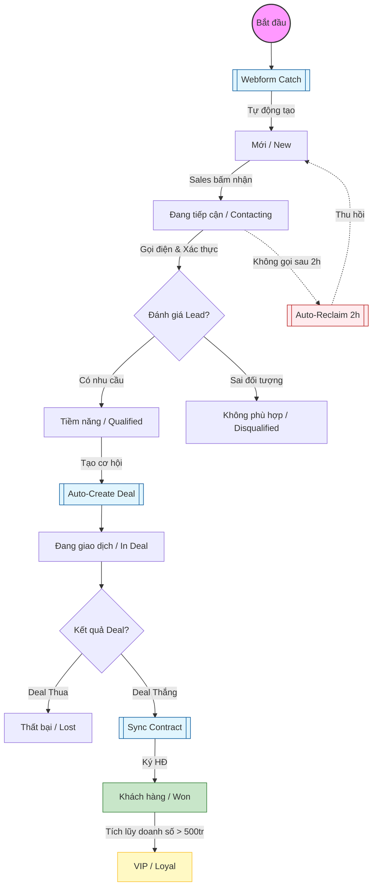
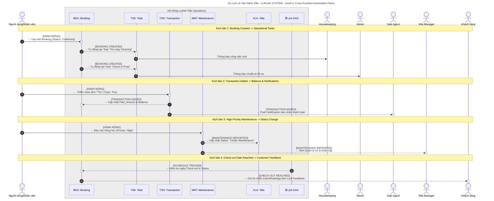
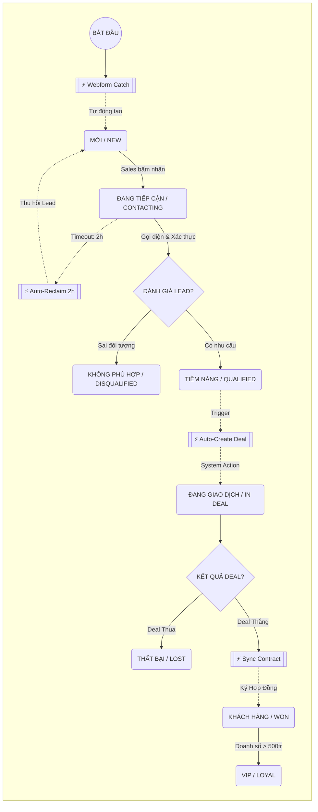

## Tổng quan Quy trình

Đối tượng **Customer** đóng vai trò trung tâm trong giải pháp LAIKA. Workflow này không chỉ quản lý trạng thái, mà còn kích hoạt các đối tượng con liên quan như **Deal** (Cơ hội), **Contract** (Hợp đồng) và **Project** (Dự án).

### Các trạng thái dữ liệu (Status Lifecycle)

<Iframe uid="f081e1eb-871e-4ba4-8ba9-859c091e9fb6" src="https://mimi-ui-demo.vercel.app/demo/teamo-yfre8k" title="Embedded content" width="560" height="600" allow-full-screen="true" frame-border="0" loading="lazy" display-mode="fixed" />

<Columns cols="2">
  <Card title="Giai đoạn 1: Tiếp nhận" icon="inbox" horizontal="false">
    - **Mới (New):** Vừa được tạo từ Webform hoặc nhập tay.

    - **Đang tiếp cận (Contacting):** Sales đã nhận và bắt đầu liên hệ.
  </Card>

  <Card title="Giai đoạn 2: Phân loại" icon="filter" horizontal="false">
    - **Tiềm năng (Qualified):** Có nhu cầu thực tế, đủ ngân sách.

    - **Không phù hợp (Disqualified):** Sai đối tượng hoặc spam.
  </Card>

  <Card title="Giai đoạn 3: Chuyển đổi" icon="briefcase" horizontal="false">
    - **Đang giao dịch (In Deal):** Đang có ít nhất 1 Deal mở.

    - **Khách hàng (Won):** Đã ký hợp đồng ít nhất 1 lần.
  </Card>

  <Card title="Giai đoạn 4: Hậu mãi" icon="star" horizontal="false">
    - **VIP / Thân thiết:** Khách hàng quay lại hoặc giá trị cao.

    - **Ngủ đông (Lost/Churn):** Không còn tương tác lâu ngày.
  </Card>
</Columns>

## Sơ đồ luồng (Flowchart)

Dưới đây là sơ đồ Mermaid mô tả luồng di chuyển trạng thái và các điểm chạm tự động hóa.



<Image src="https://blob-cdn.documentation.ai/org-fa384318-be3c-497b-8039-8f4229963c36/doc-b3b056b6-4951-4fa4-9c58-89e30e083f13/1770703690497-9vj7ekcf546-pasted-image-1770703688911.png?q=85&fm=auto&auto=compress%2Cformat" width="849" height="773" alt="" />



## Chi tiết các bước thực hiện

<Steps>
  <Step title="Bước 1: Tiếp nhận Lead (Acquisition)" icon="download" title-type="h3">
    Khách hàng đi vào hệ thống từ nhiều nguồn (Website, Facebook, Giới thiệu).

    ```
    - **Hành động:** Hệ thống tự động bắt Lead qua Automation `CS-01 Webform Catch`.
    - **Quy tắc 2 giờ:** Nếu trạng thái "Mới" giữ nguyên quá 2 giờ, Automation `IC-10` sẽ thu hồi Lead về kho chung để người khác xử lý.

    ```
  </Step>

  <Step title="Bước 2: Sàng lọc & Tư vấn (Qualification)" icon="phone-call" title-type="h3">
    Sales sử dụng tính năng **Click-to-Call** để liên hệ.

    ```
    - **Hành động:** Cập nhật trạng thái sang "Đang tiếp cận".
    - **Công cụ hỗ trợ:** Sử dụng **AI Call Intel** để tóm tắt nội dung cuộc gọi và đánh giá mức độ tiềm năng.
    - **Kết quả:** Nếu khách quan tâm, chuyển sang bước tiếp theo. Nếu spam, đánh dấu "Không phù hợp".

    ```
  </Step>

  <Step title="Bước 3: Tạo cơ hội bán hàng (Deal Creation)" icon="plus-circle" title-type="h3">
    Khi khách hàng có nhu cầu cụ thể (ví dụ: Thiết kế căn hộ 2PN), Sales sẽ tạo một **Deal** (Cơ hội) gắn với khách hàng này.

    ```
    - **Trạng thái Khách hàng:** Tự động chuyển sang "Đang giao dịch".
    - **Lưu ý:** Một khách hàng có thể có nhiều Deal tại các thời điểm khác nhau.

    ```
  </Step>

  <Step title="Bước 4: Chốt hợp đồng (Closing)" icon="file-signature" title-type="h3">
    Khi Deal thành công (`Won`), hệ thống kích hoạt chuỗi automation liên phòng ban `CF-02 Project Kickoff`.

    ```
    - **Hành động hệ thống:**
      1. Tạo **Hợp đồng** bên Kế toán.
      2. Tạo **Dự án (Master Project)** bên Triển khai.
    - **Trạng thái Khách hàng:** Chuyển sang "Khách hàng (Won)".

    ```
  </Step>

  <Step title="Bước 5: Chăm sóc & Nâng hạng (Retention)" icon="gift" title-type="h3">
    Sau khi dự án hoàn thành, bộ phận CSKH tiếp quản.&#x20;

    ```
    - **Hành động:** Gửi khảo sát NPS và quà tặng.
    - **Nâng hạng:** Nếu tổng giá trị các Hợp đồng > 500 triệu, hệ thống tự động gắn thẻ **VIP** và gửi Voucher tri ân.

    ```
  </Step>

  <Step title="New Step" title-type="p">
    Description for this step...
  </Step>
</Steps>

<Image src="https://blob-cdn.documentation.ai/org-fa384318-be3c-497b-8039-8f4229963c36/doc-b3b056b6-4951-4fa4-9c58-89e30e083f13/1770347083724-in0hfi9ky1-pasted-image-1770347079847.png?q=85&fm=auto&auto=compress%2Cformat" width="1100" height="1154" alt="" />

## Dữ liệu liên quan (Related Objects)

Để workflow này hoạt động trơn tru, đối tượng **Customer** cần liên kết dữ liệu với các đối tượng khác như sau:

| Đối tượng liên quan    | Loại liên kết  | Mục đích kinh doanh                                                 |
| ---------------------- | -------------- | ------------------------------------------------------------------- |
| **Marketing Campaign** | Nguồn (Source) | Để biết khách hàng này đến từ quảng cáo nào (Tính ROI Marketing).   |
| **Deal**               | Con (Child)    | Để quản lý từng cơ hội bán hàng riêng biệt (Mỗi lần mua là 1 Deal). |
| **Contract**           | Tham chiếu     | Để tính tổng doanh số tích lũy của khách hàng (Tính hạng VIP).      |
| **Ticket**             | Con (Child)    | Để xem lịch sử khiếu nại của khách hàng ngay trên hồ sơ.            |

<Callout kind="success" collapsed="false">
  **Mẹo quản trị:** Hãy sử dụng **Workview "My Active Customers"** để Sales chỉ nhìn thấy những khách hàng họ đang phụ trách, tránh việc tranh chấp khách hàng (Trùng Lead).
</Callout>

<Callout kind="alert" collapsed="false">
  **Mẹo quản trị:** Hãy sử dụng **Workview "My Active Customers"** để Sales chỉ nhìn thấy những khách hàng họ đang phụ trách, tránh việc tranh chấp khách hàng (Trùng Lead).
</Callout>

<Image src="https://blob-cdn.documentation.ai/org-fa384318-be3c-497b-8039-8f4229963c36/doc-b3b056b6-4951-4fa4-9c58-89e30e083f13/1770703640758-2tj4idwes3-pasted-image-1770703638798.png?q=85&fm=auto&auto=compress%2Cformat" width="1670" height="2158" alt="" style="width: 1670px; height: auto; cursor: pointer;" />





```mermaid
---
config:
  theme: neutral
  layout: elk
title: Thiên Phúc - CRM Khách sạn - Complete Workflow
---
flowchart TD
 subgraph subGraph0["🧊︎ Đặt phòng"]
        DAT_START(["Nhận đặt phòng từ OTA hoặc trực tiếp"])
        DAT_DATA[("🧊︎ Đặt phòng")]
        DAT_DATPHONGMOI("ĐẶT PHÒNG MỚI")
        DAT_XACNHAN("XÁC NHẬN")
        DAT_CHUANBI("CHUẨN BỊ")
        DAT_CHECKIN_SANSANG("CHECK-IN SẴN SÀNG")
        DAT_TUCHOI("TỪ CHỐI")
        DAT_HUYBO("HỦY BỎ")
        DAT_GW1{"Xác nhận<br>đặt phòng?"}
        DAT_GW2{"Phòng<br>có sẵn?"}
        DAT_END_SUCCESS(["Sẵn sàng cho check-in"])
        DAT_END_CANCEL(["Đặt phòng bị từ chối hoặc hủy"])
  end
 subgraph subGraph1["🧊︎ Check-in/Check-out"]
        CHK_START(["Tạo từ đặt phòng sẵn sàng"])
        CHK_DATA[("🧊︎ Check-in/<br>Check-out")]
        CHK_CHO_CHECKIN("CHỜ CHECK-IN")
        CHK_DANG_LUUTRU("ĐANG LƯU TRÚ")
        CHK_CHECKOUT_SOM("CHECK-OUT SỚM")
        CHK_CHECKOUT("CHECK-OUT")
        CHK_KHONG_DEN("KHÔNG ĐẾN")
        CHK_HOANTHANH("HOÀN THÀNH")
        CHK_GW1{"Khách<br>có đến?"}
        CHK_GW2{"Check-out<br>đúng giờ?"}
        CHK_END_SUCCESS(["Hoàn thành lưu trú"])
        CHK_END_NOSHOW(["Khách không đến"])
  end
 subgraph subGraph2["🧊︎ Dịch vụ buồng phòng"]
        DV_START(["Tạo từ yêu cầu chuẩn bị hoặc dọn phòng"])
        DV_DATA[("🧊︎ Dịch vụ<br>buồng phòng")]
        DV_CAN_DON("CẦN DỌN PHÒNG")
        DV_DANG_DON("ĐANG DỌN")
        DV_KIEMTRA("KIỂM TRA")
        DV_CHUA_DAT("CHƯA ĐẠT")
        DV_SANSANG("SẴN SÀNG")
        DV_BAOTRI("BẢO TRÌ SỬA CHỮA")
        DV_TAMDUNG("TẠM DỪNG")
        DV_GW1{"Chất lượng<br>đạt?"}
        DV_GW2{"Cần<br>bảo trì?"}
        DV_END_SUCCESS(["Phòng sẵn sàng"])
        DV_END_MAINTENANCE(["Cần bảo trì"])
  end
 subgraph subGraph3["🧊︎ Khách hàng"]
        KH_START(["Tạo từ đặt phòng đầu tiên"])
        KH_DATA[("🧊︎ Khách hàng")]
        KH_KHACHMOI("KHÁCH MỚI")
        KH_KHACHTHUONGXUYEN("KHÁCH THƯỜNG XUYÊN")
        KH_KHACHVIP("KHÁCH VIP")
        KH_KHACHTHANTHIET("KHÁCH THÂN THIẾT")
        KH_GW1{"Số lần<br>lưu trú?"}
        KH_GW2{"Tổng<br>chi tiêu?"}
        KH_END_SUCCESS(["Khách thân thiết"])
  end
 subgraph subGraph4["🧊︎ Dịch vụ bổ sung"]
        DBS_START(["Yêu cầu dịch vụ từ khách"])
        DBS_DATA[("🧊︎ Dịch vụ<br>bổ sung")]
        DBS_YEUCAU("YÊU CẦU DỊCH VỤ")
        DBS_XACNHAN("XÁC NHẬN")
        DBS_CHUANBI("CHUẨN BỊ")
        DBS_THUCHIEN("THỰC HIỆN")
        DBS_HOANTHANH("HOÀN THÀNH")
        DBS_KHONG_KHADUNG("KHÔNG KHẢ DỤNG")
        DBS_GW1{"Có thể<br>cung cấp?"}
        DBS_END_SUCCESS(["Dịch vụ hoàn thành"])
        DBS_END_UNAVAILABLE(["Không khả dụng"])
  end
    DAT_START --> DAT_DATPHONGMOI
    DAT_DATPHONGMOI -- Xử lý đặt phòng --> DAT_GW1
    DAT_GW1 -- Xác nhận thành công --> DAT_XACNHAN
    DAT_GW1 -. Từ chối đặt phòng .-> DAT_TUCHOI
    DAT_XACNHAN --> DAT_GW2
    DAT_GW2 -- Có phòng --> DAT_CHUANBI
    DAT_GW2 -. Hết phòng .-> DAT_HUYBO
    DAT_CHUANBI -- Hoàn tất chuẩn bị --> DAT_CHECKIN_SANSANG
    DAT_CHECKIN_SANSANG --> DAT_END_SUCCESS
    DAT_TUCHOI --> DAT_END_CANCEL
    DAT_HUYBO --> DAT_END_CANCEL
    CHK_START --> CHK_CHO_CHECKIN
    CHK_CHO_CHECKIN --> CHK_GW1
    CHK_GW1 -- "Check-in thành công" --> CHK_DANG_LUUTRU
    CHK_GW1 -. "Khách no-show" .-> CHK_KHONG_DEN
    CHK_DANG_LUUTRU --> CHK_GW2
    CHK_GW2 -- "Check-out đúng giờ" --> CHK_CHECKOUT
    CHK_GW2 -. "Check-out sớm" .-> CHK_CHECKOUT_SOM
    CHK_CHECKOUT -- Hoàn tất quy trình --> CHK_HOANTHANH
    CHK_CHECKOUT_SOM -- "Xử lý check-out sớm" --> CHK_HOANTHANH
    CHK_HOANTHANH --> CHK_END_SUCCESS
    CHK_KHONG_DEN --> CHK_END_NOSHOW
    DV_START --> DV_CAN_DON
    DV_CAN_DON -- Bắt đầu dọn --> DV_DANG_DON
    DV_DANG_DON -- Hoàn thành dọn --> DV_KIEMTRA
    DV_DANG_DON -. Tạm dừng công việc .-> DV_TAMDUNG
    DV_KIEMTRA --> DV_GW1 & DV_GW2
    DV_GW1 -- Đạt tiêu chuẩn --> DV_SANSANG
    DV_GW1 -. Chưa đạt tiêu chuẩn .-> DV_CHUA_DAT
    DV_CHUA_DAT -. Dọn lại .-> DV_DANG_DON
    DV_GW2 -. Cần bảo trì .-> DV_BAOTRI
    DV_TAMDUNG -. Tiếp tục .-> DV_DANG_DON
    DV_SANSANG --> DV_END_SUCCESS
    DV_BAOTRI --> DV_END_MAINTENANCE
    KH_START --> KH_KHACHMOI
    KH_KHACHMOI --> KH_GW1
    KH_GW1 -- "Lưu trú 2-5 lần" --> KH_KHACHTHUONGXUYEN
    KH_KHACHTHUONGXUYEN --> KH_GW2
    KH_GW2 -- Chi tiêu cao --> KH_KHACHVIP
    KH_KHACHVIP -- Nhiều năm gắn bó --> KH_KHACHTHANTHIET
    KH_KHACHTHANTHIET --> KH_END_SUCCESS
    DBS_START --> DBS_YEUCAU
    DBS_YEUCAU --> DBS_GW1
    DBS_GW1 -- Có thể cung cấp --> DBS_XACNHAN
    DBS_GW1 -. Không thể cung cấp .-> DBS_KHONG_KHADUNG
    DBS_XACNHAN -- Chuẩn bị dịch vụ --> DBS_CHUANBI
    DBS_CHUANBI -- Bắt đầu thực hiện --> DBS_THUCHIEN
    DBS_THUCHIEN -- Hoàn thành dịch vụ --> DBS_HOANTHANH
    DBS_HOANTHANH --> DBS_END_SUCCESS
    DBS_KHONG_KHADUNG --> DBS_END_UNAVAILABLE
    DAT_CHUANBI L_MF1@-. Chuẩn bị phòng .-> DV_START
    DAT_CHECKIN_SANSANG L_MF2@-. "Tạo check-in" .-> CHK_START
    DAT_XACNHAN L_MF3@-. Tạo dịch vụ đi kèm .-> DBS_START
    DAT_DATPHONGMOI L_MF4@-. Tạo/cập nhật khách hàng .-> KH_START
    CHK_CHECKOUT L_MF5@-. Tạo công việc dọn phòng .-> DV_START
    CHK_HOANTHANH L_MF6@-. Cập nhật loyalty points .-> KH_GW1
    DV_SANSANG L_MF7@-. Thông báo phòng sẵn sàng .-> DAT_CHECKIN_SANSANG
    KH_KHACHVIP L_MF8@-. Tạo dịch vụ VIP .-> DBS_START
    DBS_HOANTHANH L_MF9@-. Cập nhật sở thích .-> KH_GW2
    WEBHOOK(["Webhook từ OTA"]) L_MF10@-. Đặt phòng từ OTA .-> DAT_START
     DAT_DATPHONGMOI:::mo
     DAT_XACNHAN:::hoatdong
     DAT_CHUANBI:::hoatdong
     DAT_CHECKIN_SANSANG:::hoanthanh
     DAT_TUCHOI:::donghuy
     DAT_HUYBO:::donghuy
     CHK_CHO_CHECKIN:::kehoach
     CHK_DANG_LUUTRU:::hoatdong
     CHK_CHECKOUT_SOM:::hoatdong
     CHK_CHECKOUT:::hoatdong
     CHK_KHONG_DEN:::donghuy
     CHK_HOANTHANH:::hoanthanh
     DV_CAN_DON:::mo
     DV_DANG_DON:::hoatdong
     DV_KIEMTRA:::hoatdong
     DV_CHUA_DAT:::tamdung
     DV_SANSANG:::hoanthanh
     DV_BAOTRI:::tamdung
     DV_TAMDUNG:::tamdung
     KH_KHACHMOI:::mo
     KH_KHACHTHUONGXUYEN:::hoatdong
     KH_KHACHVIP:::hoanthanh
     KH_KHACHTHANTHIET:::hoanthanh
     DBS_YEUCAU:::mo
     DBS_XACNHAN:::hoatdong
     DBS_CHUANBI:::hoatdong
     DBS_THUCHIEN:::hoatdong
     DBS_HOANTHANH:::hoanthanh
     DBS_KHONG_KHADUNG:::donghuy
    classDef mo fill:#F8F9FA,stroke:#64718B,stroke-width:2px,color:#213459
    classDef kehoach fill:#E6FBFF,stroke:#33CCFF,stroke-width:2px,color:#213459
    classDef hoatdong fill:#E8F4FF,stroke:#358AFF,stroke-width:2px,color:#213459
    classDef tamdung fill:#FFF7ED,stroke:#FF7E46,stroke-width:2px,color:#213459
    classDef hoanthanh fill:#E8FDF4,stroke:#1AD598,stroke-width:2px,color:#213459
    classDef donghuy fill:#F8F9FA,stroke:#213459,stroke-width:2px,color:#213459
    linkStyle 54 stroke:#FF6D00
    linkStyle 59 stroke:#FF6D00,fill:none
    L_MF1@{ animate: true } 
    L_MF2@{ animate: true } 
    L_MF3@{ animate: true } 
    L_MF4@{ animate: true } 
    L_MF5@{ animate: true } 
    L_MF6@{ animate: true } 
    L_MF7@{ animate: true } 
    L_MF8@{ animate: true } 
    L_MF9@{ animate: true, animation: fast } 
    L_MF10@{ animate: true }

```

[View on Eraser](https://app.eraser.io/workspace/PyjRjHIETEC8gqjNwyeS?diagram=J8-WqjuhcjGmG9wvuQNMO)
