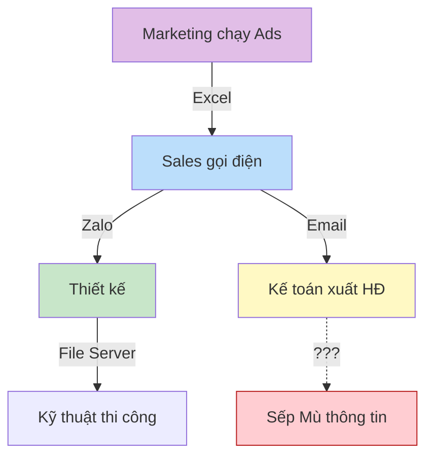
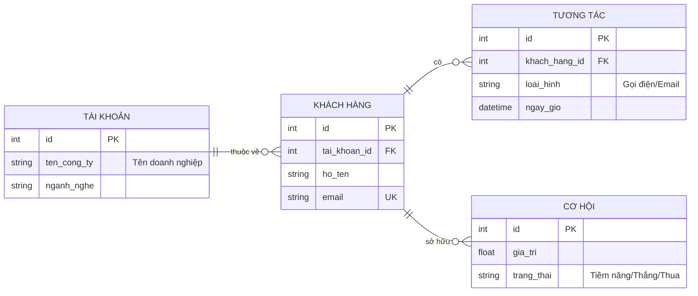

## Bức tranh "Hỗn loạn" hiện tại

Có phải doanh nghiệp của bạn đang vận hành trên quá nhiều nền tảng rời rạc? Dữ liệu bị đứt gãy khiến các bộ phận không thể phối hợp nhịp nhàng.

<Callout kind="danger" collapsed="false">
  **Hệ quả:** 1. Dữ liệu phải nhập lại nhiều lần (Re-entry) ➔ Sai sót.
  2\. Thông tin "trôi" trên Zalo ➔ Quên việc, mất file.
  3\. Sếp không có báo cáo tức thời ➔ Ra quyết định chậm.
</Callout>

## Điểm đau theo từng Bộ phận

Hãy chọn vai trò của bạn để xem những vấn đề cụ thể mà giải pháp LAIKA sinh ra để giải quyết.

## Ma trận Tác động & Giải pháp

Nếu bạn gặp phải những vấn đề trên, dưới đây là cách LAIKA sẽ giải quyết chúng trong phần Demo tiếp theo.

| Điểm đau (Pain Point)           | Tại sao nó xảy ra?                               | LAIKA giải quyết thế nào?                                                        |
| ------------------------------- | ------------------------------------------------ | -------------------------------------------------------------------------------- |
| **Không đo được ROI Marketing** | Marketing và Sales dùng 2 tool khác nhau.        | **Revenue Ops:** Đồng bộ doanh thu từ Deal về lại Campaign.                      |
| **Sales lười gọi khách**        | Không có công cụ giám sát thời gian thực.        | **Automation IC-10:** Tự động thu hồi Lead sau 2 giờ không xử lý.                |
| **Mất thời gian làm Hợp đồng**  | Copy-paste từ tin nhắn vào file Word.            | **Auto-Proposal:** 1 Click tạo Hợp đồng/Báo giá từ dữ liệu CRM.                  |
| **Sai sót khi đặt hàng (PO)**   | Nhập lại mã hàng từ Báo giá sang Excel đặt hàng. | **Quote to PO:** Tự động chuyển Báo giá đã duyệt thành Đơn đặt hàng.             |
| **Quên thu nợ**                 | Kế toán phải soi Excel hàng ngày.                | **Billing Trigger:** Tự động nhắc nợ/xuất hóa đơn khi PM báo cáo xong giai đoạn. |

<Callout kind="success" collapsed="false">
  **Câu hỏi xác nhận:**
  "Trong các vấn đề nêu trên, đâu là **nỗi đau lớn nhất** đang kìm hãm sự tăng trưởng của anh/chị ngay lúc này?"
</Callout>

