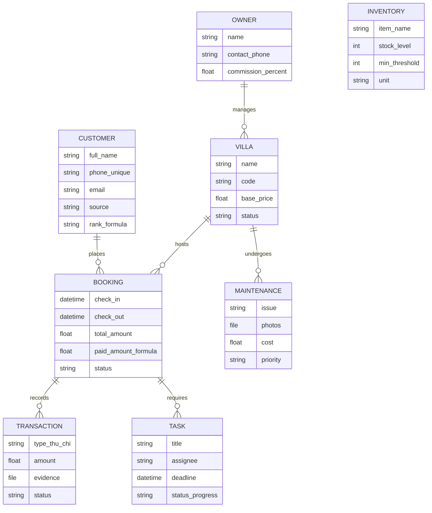
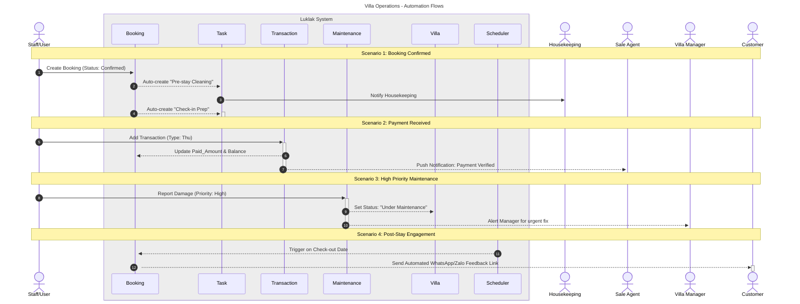

## Overview

This document provides the complete technical blueprint for the **Du Lịch và Vận Hành Villa** (Villa Tourism & Operations) system. Designed for the Luklak platform, this configuration centralizes property management, guest relations, operational workflows, and financial integrity

## Visual Architecture

### Entity Relationship Diagram (ERD)

The following diagram illustrates the data structure and connectivity between core entities within the system.

---

## Data Model

### Entity Definitions & Attribute Map

This schema ensures all metadata, from room counts to financial entries, is captured accurately.

| Entity          | Technical Name | Key Attributes (Type)                                                                                     | Notes                                 |
| --------------- | -------------- | --------------------------------------------------------------------------------------------------------- | ------------------------------------- |
| **Villa**       | `villa`        | Name (Text), Code (Text), Owner (Link), Base Price (Currency), Status (Select)                            | Metadata: Room Count, Amenities.      |
| **Booking**     | `booking`      | Villa (Link), Customer (Link), Check-in/Out (DateTime), Total (Currency), Paid (Formula), Status (Select) | The central "Event" entity.           |
| **Customer**    | `customer`     | Full Name (Text), Phone (**Unique**), Email (Email), Source (Select), Rank (Formula)                      | Prevents duplicates via Phone Number. |
| **Transaction** | `transaction`  | Booking (Link), Type (Thu/Chi), Amount (Currency), Evidence (File), Status (Select)                       | All cash flow entries.                |
| **Task**        | `task`         | Title (Text), Assignee (User), Deadline (DateTime), Booking (Link), Status (Progress)                     | Cleaning, Check-in, etc.              |
| **Maintenance** | `maintenance`  | Villa (Link), Issue (Long Text), Photos (File), Cost (Currency), Priority (Select)                        | Damage reporting from the field.      |
| **Inventory**   | `inventory`    | Item Name (Text), Stock Level (Number), Min Threshold (Number), Unit (Select)                             | Consumables management.               |
| **Owner**       | `owner`        | Name (Text), Contact (Phone), Commission % (Percent), Linked Villas (Link)                                | Profit-sharing and reporting.         |

### Connection Logic

1. **Villa ↔ Booking (1:N):** Drives the **Calendar View** (Villa = Y-axis, Date = X-axis).

2. **Booking ↔ Transaction (1:N):** Rolls up multiple payments (Deposit + Final) to calculate `Total Paid`.

3. **Booking ↔ Task (1:N):** Tracks operational fulfillment for specific reservations.

4. **Villa ↔ Maintenance (1:N):** Tracks the lifecycle and "Health History" of assets.

5. **Owner ↔ Villa (1:N):** Aggregates revenue for investor reporting.

---

## Automation & Logic

### Business Logic Formulas

| Target Field          | Formula Logic                                                                                |
| --------------------- | -------------------------------------------------------------------------------------------- |
| **Paid Amount**       | `SUM(links.transaction.amount WHERE status == 'Verified' AND type == 'Thu')`                 |
| **Remaining Balance** | `total_amount - paid_amount`                                                                 |
| **Payment QR**        | `https://img.vietqr.io/image/bank-account-template.jpg?amount={amount}&addInfo={booking_id}` |

### Automation Flows

The following sequence diagram detail how Luklak orchestrates tasks and notifications across departments.

---

## Operations & Security

### Dashboard Layouts

- **Management (Web):** Occupancy heatmaps, revenue charts (Thu vs Chi), and task burndown widgets.

- **Mobile App (Operational):** "My Tasks" (filtered by user) and a "Quick Report" button for maintenance.

- **Owner Portal:** Financial summaries showing net payout after commission deductions.

### Permission Matrix

| Role           | Villa  | Booking | Transaction  | Maintenance | Inventory |
| -------------- | ------ | ------- | ------------ | ----------- | --------- |
| **Admin**      | CRUD   | CRUD    | CRUD         | CRUD        | CRUD      |
| **Sales**      | View   | CRUD    | Create (Thu) | View        | View      |
| **Operations** | View   | View    | Create (Chi) | CRUD        | RU        |
| **Owner**      | View\* | View\*  | View\*       | View\*      | None      |

### Technical Safeguards

