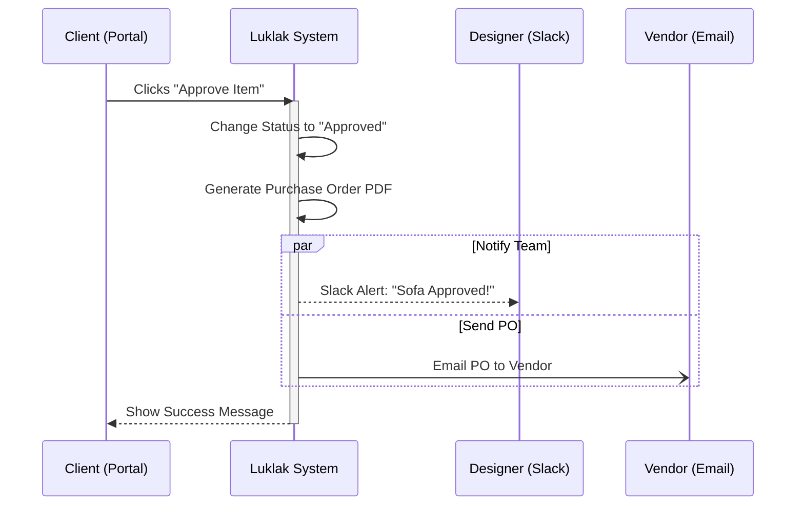

## Sơ đồ Tổng quan (Mermaid Flowchart)

Sơ đồ dưới đây chia doanh nghiệp thành 3 "Động cơ" chính:

1. **Revenue Engine (Màu xanh dương):** Kiếm tiền (Marketing ↔ Sales)

2. **Delivery Engine (Màu cam/vàng):** Thực hiện lời hứa (Dự án ↔ Thiết kế ↔ Mua hàng ↔ Kế toán).

3. **People & Ops Engine (Màu xanh lá):** Hậu cần (Nhân sự ↔ Tài sản).

